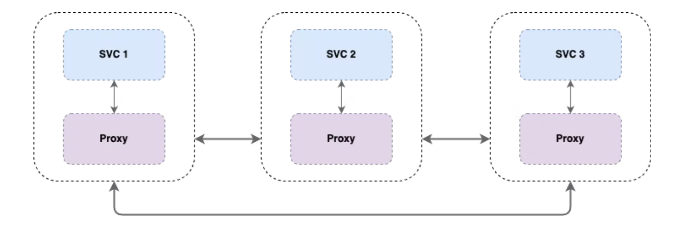
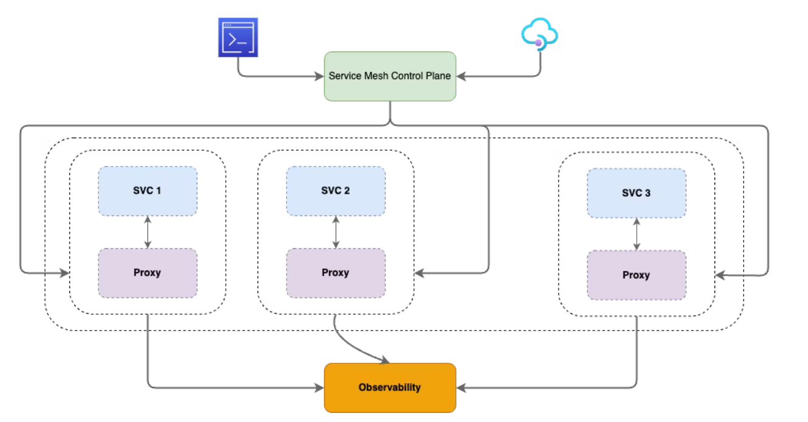
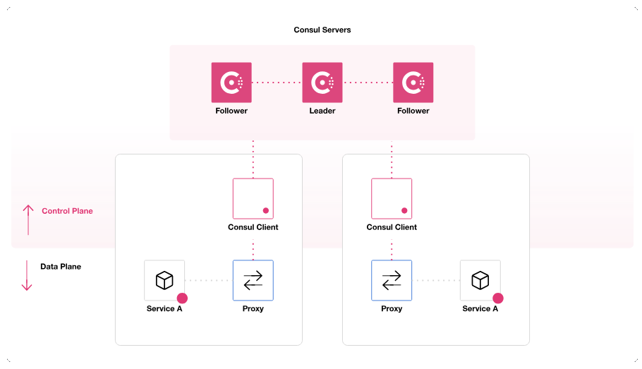
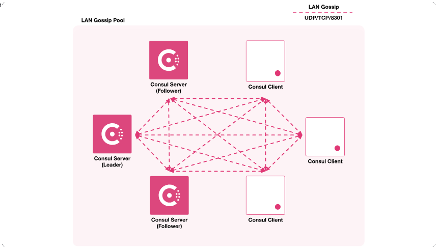
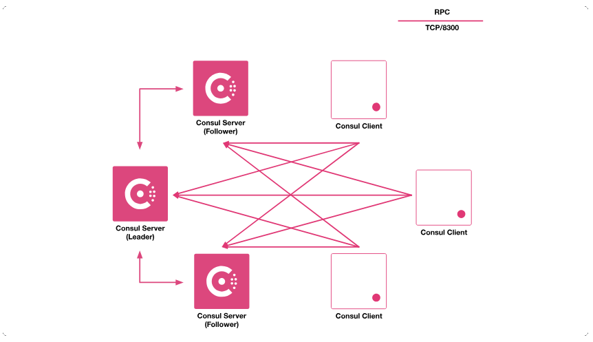
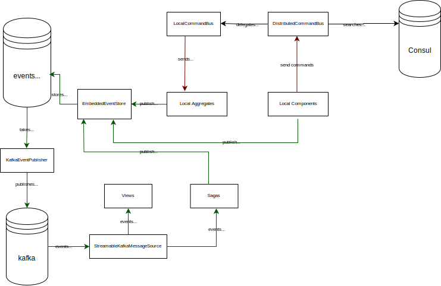

# Service mesh

* A Service Mesh (сервисная сетка) -  is a mechanism for managing communications between the various individual services.
* Service mesh capabilities:
    1. Service discovery
    1. Service configuration
    1. Network features: acl, load balancing, network retries etc
* Sidecar (коляска) - is a network proxy providing load balancing, retries etc. Network proxy replicated alongside each microservice.
* The data plane (панель) is made up of services running alongside sidecar proxies. 
  The services handle business logic, while proxies sit between them and other services. 
  All traffic, ingress (входной), and egress (выходной) occur through the proxies, which are responsible for routing (proxying) traffic to other services.

* The control pane (панель) configures and manages sidecars (proxies). 
  Using web or cli interface it is possible to define routing rules,acls. It also can be used to export observability data such as metrics, logs, and traces.

# Consul
* Consul is an open-source control pane implementation.
* Datacenter contains at least one consul server and at least one agent. It is the smallest unit of Consul infrastructure that
  can perform basic operations.
* Client agent report node and service health status to the Consul cluster. 
  In a typical deployment, you must run client agents on every compute node in your datacenter. Clients use remote procedure calls (RPC) to interact with servers.
  By default, clients send RPC requests to the servers on port 8300. If agent is running alone it is treated as server.
* Consul server agents store all state information, including service and node IP addresses, health checks, and configuration.
  Consul servers are responsible for service discovery and maintaining key/value data.
* Consul web ui runs on port 8500.  

* Consul agents (client and servers) use lan gossip protocol on port 8301 which allows auto discovery and health information check propagation. They use upd with tcp fallback.

* RPC protocol is used by agents for communication on port 8300.

# Axon infrastructure
